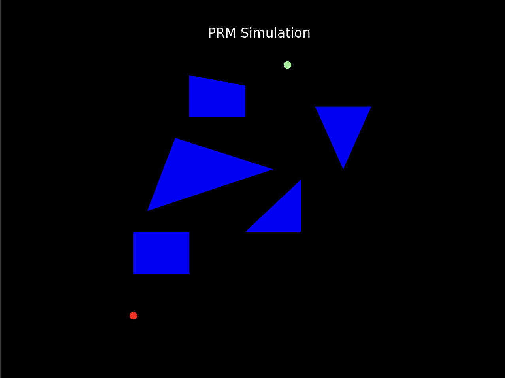
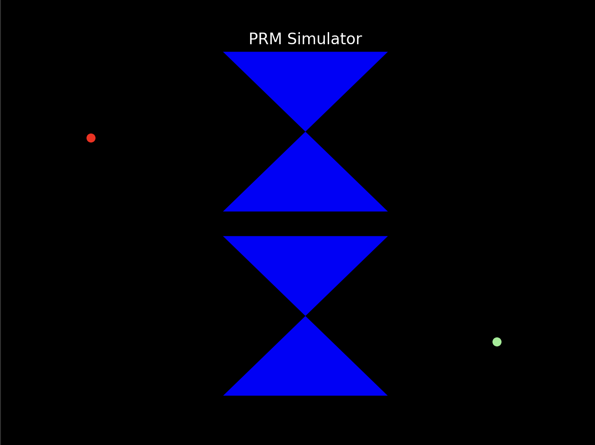
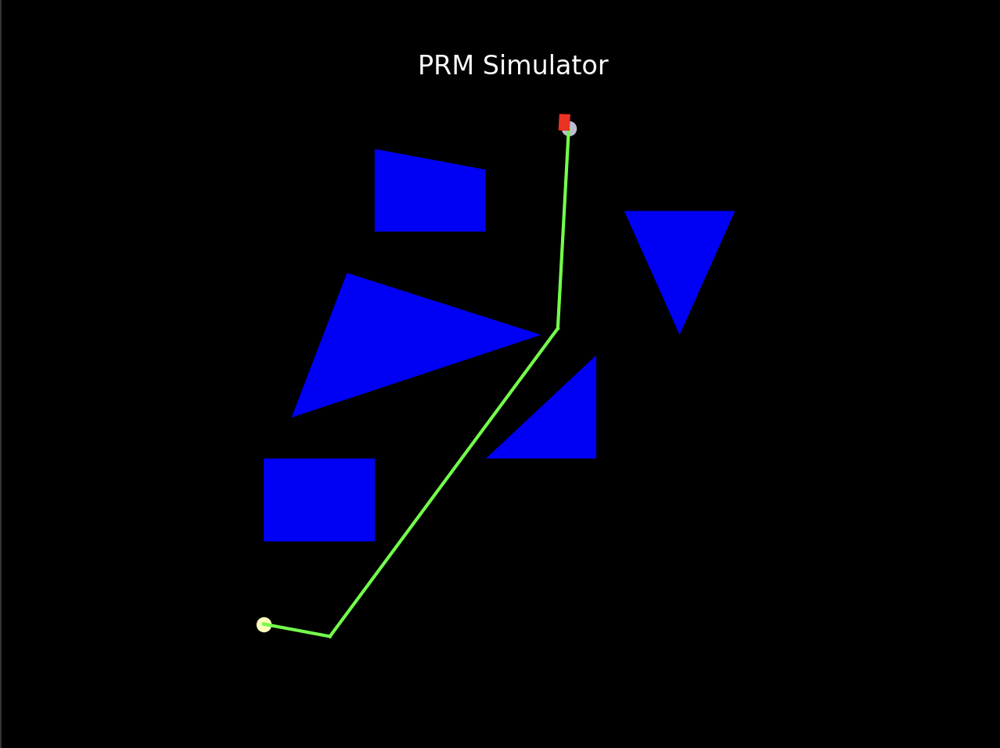
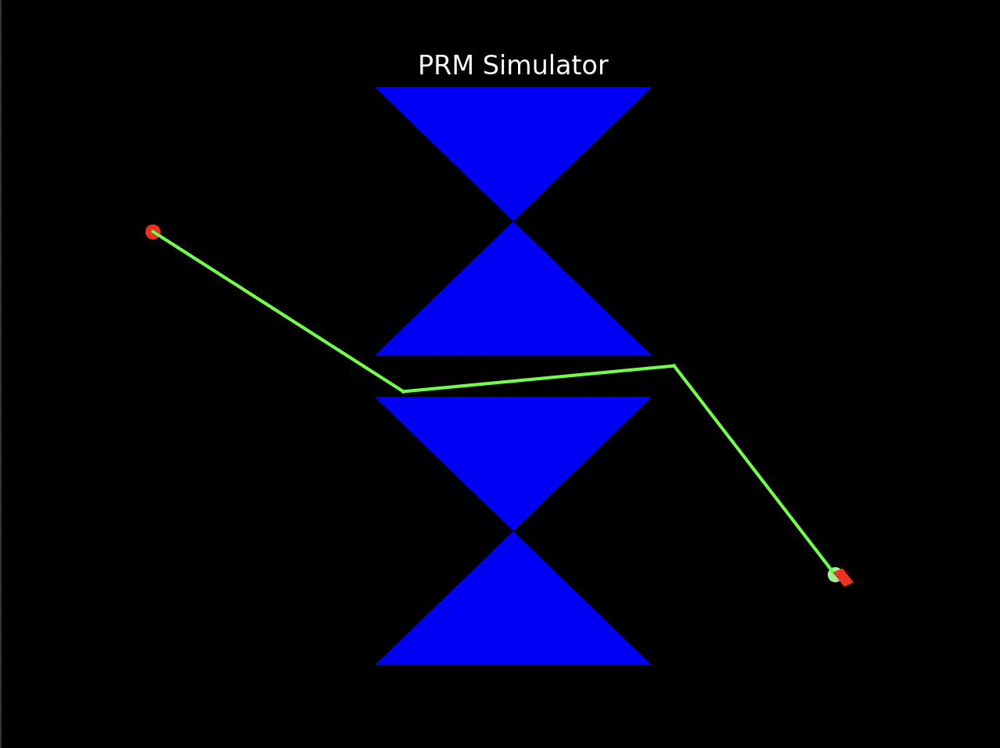

# ProbabilisticRoadMap-In-Simulation

In the AI world path planning is a fundamental problem in robotics where we need to determine
a safe and efficient path for a robot to navigate from a starting point to a desired destination.
Probabilistic roadmap is an algorithm that is used to find optimal paths in a very complex
environment. Basically, PRM uses a probabilistic approach to determine a roadmap of potential
paths without contacting any obstacles to reach its goal point.

The main implementation that PRM does is by firstly randomly sampling points in the complex
environment and then it uses these nodes to connect and create valid edges for the robot to
travel and this connection is done in a graph like structure. The main key advantage of using PRM
based path planning algorithm is that it can handle highly dynamic and cluttered environment in
a very efficient way. The other main advantage is that the probabilistic nature of the algorithm
allows a certain degree of flexibility and uncertainty. This makes it well suited for uncertain and
changing environments.

The goal of this project is trying to find the shortest path or more optimized path to reach the
goal point from the start point by using the PRM implementation where we need to take random
samples from the C-space and find all the edges that are not intersecting with any obstacles and
finally to find a shortest path with all these edges.

## Technical Details 

Firstly, in a particular frame I initialized obstacles of the form of Rectangles and Triangles. I took
the coordinates of each of the obstacles and plotted the patch of the obstacles as you can see
from the below image.

Here the red point is the start point and the green point is the goal point. We could also see that
shortest distance to reach the goal point has a narrow path in-between. To perform the same
task on a narrow path I’ve developed another obstacle map as below.

In the above there is a narrow passage form the starting Red point to the ending Green point.

Now following the PRM Pseudocode I have initialized 2 nodes s (red start node) and g (green goal
node) for the roadmap. Now to sample configurations from the C space I used random.uniform
to sample uniform coordinates. Initially I took 50 samples which includes the goad state too.

Now starting from the starting point, I would check all the sample coordinates in the C-space and
find whether they intersect with any of the obstacle. I have used a simple finding intersection
between line segments to find all the nodes. Now I keep track of all these possible edges. My
dictionary structure is such a way that the keys will be all the possible nodes from the starting
point and the values will be all the nodes that can be reached from that particular node. I feed I
this dictionary into my path planning algorithm.

## Path planning Algorithm

Here I tried to determine the shortest path for the robot to reach the goal state from the start point. For
this part of implementation, I first tried to get all the possible nodes into a dictionary format. Then I create
a heap with distance to the goal, the current node, the distance covered and the path. This way whenever
I pop out a node it will be the node with the least distance to the goal point. Since I keep track of the path
it has traversed, I don’t need to backtrack here. Whenever the goal point is reached, I maintain the
distance covered in a separate variable. This way I check for the shortest path.

## Results

Firstly, for the map with random obstacles for each sampling I get different shortest paths
depending on the samples. Here I’m taking a sample of 40. Taking more than 40 samples takes a
lot of time to produce the shortest path as it has to compare with all the possible nodes. But
taking 40 as sample size gives the best result by finding a shortest path from the start point to
the goal.

Secondly for the narrow path I provided weights when it comes to sampling. Giving higher
weights to the samples near the narrow passage will give more accurate result on the shortest
path. Below is the image of the RoadMap of the robot in a narrow path.

In the above RoadMap there is only a single passage towards the goal, and it is a narrow point,
so by applying weights on the area around the narrow passage we could provide this result just
with 20 samples.

The main issue I faced while implementing this PRM simulator is when I had to make the
Rectangle head move according to the path angle. For this I calculated the velocity depending on
the frame rate and the total distance and this gave me the frame rate for each edge of the
shortest path. This was using arctan2 I was able to achieve the required goal by moving the
rectangle in the path with appropriate angle.

Also, I believe my path planning algorithm can be optimized even more as it is taking a longer
time to find the shortest path for samples more than 50. If it takes a long time, then mostly the
sample couldn’t find a path to the goal, and I automatically terminate the program if it takes
more than 30 sec. Depending on the samples the shortest path are considered.

This course was interesting to me as I was able to gain knowledge in the area of Robotics and I
always wanted to work for companies that provide solution for autonomous driving, and I believe
this project have helped me a lot to grasp an idea of how autonomous driving works in real time.
